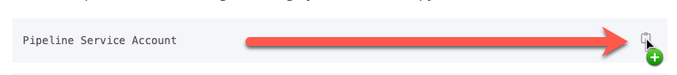

# Before you begin

<button class="btn btn-green fs-3" disabled>Estimated Time to Complete: 5 minutes</button>


## Copy Paste

There are several times in the exercises where you will need to copy and paste values. 

To make this easier, we have added a clipboard icon to the end of the fields to automatically copy to your clipboard for you. 



Here is an example to play with:

```markdown
Copy me!
```

<input type="text" name="paste" placeholder="Press CTRL+V to paste">

---

## Triple Click

Did you know you can triple click to select an entire row on a webpage? 

Try it using the table below.

| Select this entire sentence by triple clicking then press CTRL+C to copy.

<input type="text" name="paste" placeholder="Press CTRL+V to paste">

---

## Username and Passwords

In some of the sections, you will be copying and pasting user credentials. 

You MUST use the values provided as that is the password that is already set for that account. 

If you do not use the provided username and password, you will get the following error:


{: .warning}
> Could not connect to the environment. [Method failed: (/api/sn_pipeline/pipeline/validate_connection) with code: 401 - **Invalid username/password combo**]


[Next](/lab-aemc-utah/docs/lab-instance){: .btn .btn-green .fs-2}