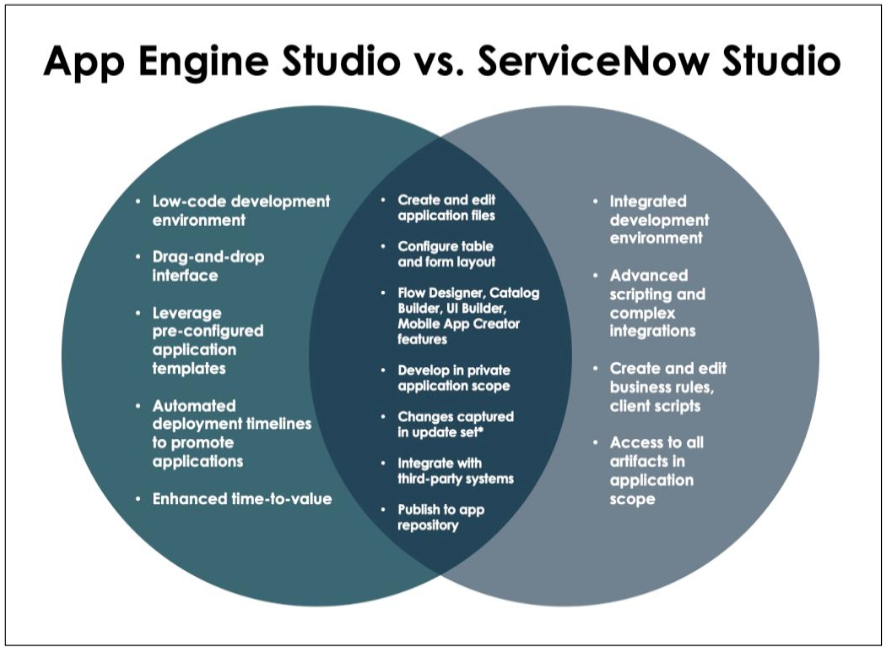

# App Engine Studio Overview

{: .highlight}
> This part of the lab is for information purposes only. No activity required.

**App Engine Studio** and **App Engine Management Center** are available with an App Engine Subscription and are designed from the ground up to address low-code development needs.

**App Engine Studio** is designed from the ground up to address no-code/low-code development needs. **App Engine Studio** enables professional developers, line of business technologists (citizen developers), and low-code developers to build applications individually or in collaborative teams on the same platform, resulting in faster time to value and better applications that scale without sprawl.

With guidance-driven development flows and pre-configured application templates, developers across the enterprise can build and deliver apps quickly. Developers can leverage many out-of-box components available through drag-and-drop interfaces to create fulfilling user experiences that are critical to end-user adoption.

With **App Engine Management Center**, Administrators control which applications to deploy by reviewing and testing applications created by App Engine Studio developers – and by delegating development to business units in your organization, administrators are freed up to address more strategic, system-wide issues.

**App Engine Studio** is the ideal ServiceNow development environment for no-code and low-code application development for developers of all skill levels. Pro-code developers can use App Engine Studio as a starting point for application development and easily transfer their applications to **ServiceNow Studio** when advanced configurations are necessary. 

Since development is supported between the two developer environments, low-code and pro-code developers can easily collaborate to deliver custom applications.

All configurations to an application, whether performed in **App Engine Studio** or **ServiceNow Studio**, can be captured in the same private application scope. Application artifacts configured in **App Engine Studio** can also be managed in **ServiceNow Studio**.

{: .note}
> For more information see **[Product Documentation: Build apps using App Engine Studio](https://docs.servicenow.com/csh?topicname=aes-overview.html&version=latest)**

{: .note}
> For more information see **[Product Documentation: Managing app development using the App Engine Management Center](https://docs.servicenow.com/csh?topicname=monitor-requests-using-aemc.html&version=latest)**

{: .note}
> For more information see **[Product Documentation: ServiceNow Studio](https://docs.servicenow.com/csh?topicname=c_ServiceNowStudio.html&version=latest)**

[Next](/lab-aemc-utah/docs/personas-and-roles){: .btn .btn-green .fs-2}