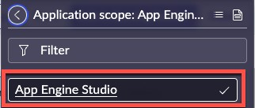

# 1) App Engine Studio

In this lab, we will review and update App Engine Studio developer access to builder tools during development.

App Engine Studio is configured and used in the **Dev** environment where development will occur. 

It may be installed in Prod for cloning purposes. 

{: .warning}
> | **FOR LAB 1**
> | Be sure your application scope is set to **App Engine Studio**. If it is not, use the application picker to change the current session's scope. 
> | 

| 1) Log in to your **Dev** Lab instance. 

| 2) Click **All**.

| 3) Type **App Engine**.

| 4) Look for **Configuration** -> **Guided Setup**.

| 5) Click on **Guided Setup**. 
| 

| 6) Click on **Get** **Started**.
|  

| 7) Click on **Get Started** in the **Review and setup tooling** section.
|  

| 8) Click on **Skip** in the **Connect Spokes** section.
|  

{: .note}
>We are skipping **Connect Spokes** for this lab. In that section, you would install and configure credentials to for Integration Hub Spokes so that they can be leveraged by App Engine Users building applications.
>
> For more information see: **[Product Documentation: Integration Hub available spokes](https://docs.servicenow.com/csh?topicname=spokes-list.html&version=latest)**

| 9) In the **Review Flow Designer access settings** section, click **Configure**. 
|  

| 10) Review the **Flow Designer access settings**.
|  

| 11) When you are done reviewing the Flow Designer access settings, close out the modal. 
| 

| 12) Click **Mark as Complete**. 
|  

Notice that the % Complete has increased on the page.

|  

{: .note }
> For the purposes of this lab, we are only reviewing where to manage the Flow Designer access settings.
>
> Configure which Flow Designer content (Ex. Flows, Subflows, Actions) a user can access based on the user's role, hiding content that is unnecessary or sensitive. 
>
> For example, if a user with the hr_manager role in human resources is creating a flow, show only the set of Actions and Subflows that are relevant to HR cases.
>
> *What Flow Designer content access would you configure in your environment?*
>
> For more information see: **[Product Documentation: Manage access to Flow Designer features](https://docs.servicenow.com/csh?topicname=manage-access-features.html&version=latest)**

| 13) In the section **Review Service Catalog access settings**, click on **Configure**.
|  

| **OPTIONAL:** Review App Engine Studio developer access to the Catalog Builder tool’s catalog item templates and catalogs / categories. 
| 

| 14) Click **Mark as Complete** on the **Review Service Catalog access settings** section.
|  

{: .note}
> By default, App Engine Studio developers can leverage catalog templates to quickly create record producers or catalog items. Developers can also publish catalog items to any catalog. 
>
> If you wish to limit access to templates or restrict publishing access to catalogs or categories, update the access accordingly in Catalog Builder.
>
> *What settings would you adjust in your environment?*
>
> For more information see: **[Product Documentation: Set up the catalog builder](https://docs.servicenow.com/csh?topicname=set-up-cat-builder.html&version=latest)**

| 15) Click **Configure** in the section **Set up an instance scan cadence in Health Center**.
|  

| **OPTIONAL:** Explore some of the Instance Scan definitions.
|  

| 16) When you are done exploring, click **X** to close the modal.
|  

| 17) Click **Mark as Complete** on the **Set up an instance scan cadence in Health Center**.
|  

{: .note}
> *For the purposes of this lab, we are only reviewing where to manage the Instance Scan definitions.*
>
> Use Instance Scan to interrogate your instance for configurations that indicate health issues and identify opportunities to address best practices. Instance Scan checks your existing configurations and helps you avoid creating future configuration issues. Instance Scan is a tool that can be used as a part of your development operations, release management as well as pre- and post-upgrades.
>
> *Consider how you might leverage Instance Scan as part of an App Deployment strategy.*
>
> For more information see: **[Product Documentation: Instance Scan](https://docs.servicenow.com/csh?topicname=hs-landing-page.html&version=latest)**

| 18) Click the gray circle on the left hand side of the page below the green check mark. It should say **Set up user access** when you hover over it.  
|  

| 19) Click **Get Started** in the **Set up user access** section.
|  

| 20) Click **Configure** in the **Set up admin group** section.
|  

| 21) Click **Edit...** on the **Group Members** tab.
| 

| 22) Move **Jayne Nigel** to the right hand side and click **Save**.
|  

{: .important}
> Jayne will play the part of our App Engine Admin in Lab 5.

| 23) Click the **Group = App Engine Admins** filter on the **Group Members (1)** related list to refresh the list.  
|  

You should see **Jayne Nigel** appear in the **User** column after a few seconds.

| 24) Click the **X** in the top right corner to close the modal.  
| 

| 25) Next to **Set up admin group** click **Mark as Complete**.
| 

| 26) Next to **Grant access to your current developers** click **Skip**.
| 

{: .important}
> We are skipping **Grant access to your current developers** for this lab. 
>
> This is for configuring Developers in Dev that have pre-existing permissions. 

| 27) Click **Configure** next to **Grant access to other users**.
|  

| 28) Click **Edit** on the **Group Members** related list. 
|   

| 29) Move **Abel Tuter** to the right hand side and click **Save**.  

| 30) Click the **X** in the top right of the modal to close it. 
|  

| 31) Next to **Grant access to other users** click **Mark as Complete**. 
| 

{: .note-title}
> Why move Abel to the group? 
>
> Adding him to the group will grant him the role **sn_app_eng_studio.user**.  This role will allow him to access App Engine Studio.

**Congratulations!**  

App Engine Studio is ready to go in your Dev environment!

[Next](/lab-aemc/docs/credentials){: .btn .btn-green .fs-2}