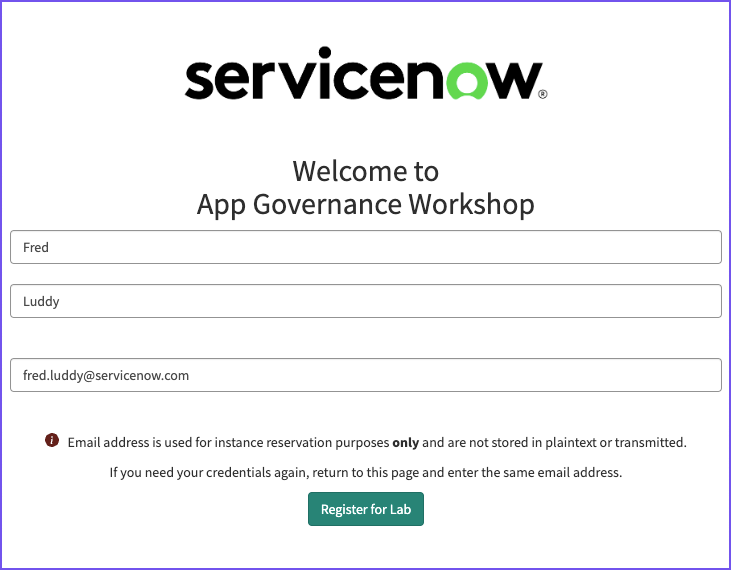

# 1) Get a Lab instance

<button class="btn btn-green fs-3" disabled>Estimated Time to Complete: 5 minutes</button>

## Overview 

In this exercise, you will register for and access two distinct ServiceNow Lab instances. These instances will be utilized throughout the lab to familiarize yourself with different aspects of ServiceNow. 

## Instructions 

{: .note}
> Your instructor will provide you with a URL that will load a form similar to below. 

| 1) Enter your name and email address, then click the button **Register for Lab**. 
| 

{: .important}
> Remember, if you lose your credentials, you can return to this page and re-enter the same information to retrieve them.

| 2) Enter the unique registration code provided by your instructor and click **Complete Registration**.
| 

{: .highlight}
> ServiceNow provisions Labs with two instances labeled "dev" and "test" in the URL. Despite the naming, refer to and utilize the "test" instance as your "Prod" instance for the entirety of this Lab.

| 3) A final screen will be displayed with the URL for your **Dev** and **Prod** instances. 
| 

Click on the **Magic Link** (a unique link that, when clicked, automatically logs you in) to be taken directly to an instance.

## Lessons Learned

Upon completing this section, you've achieved the following:
- Successfully registered for two ServiceNow Lab instances.
- Understand the distinction between the "dev" and "test" instances.
- Know how to retrieve lost credentials.
- Can access and log in to each instance through the provided Magic Links.

Proceed by clicking 'Next' to continue with the lab and learn how to manage credentials in a Prod environment.

[Next](/lab-aemc-utah/docs/credentials-prod){: .btn .btn-green .fs-2}