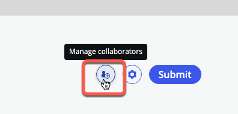
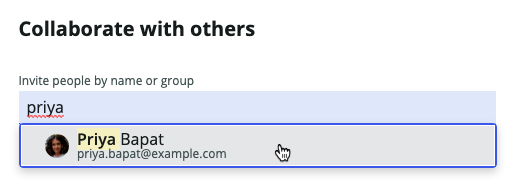
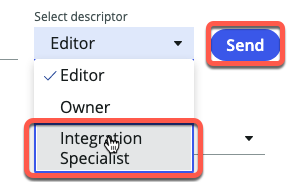
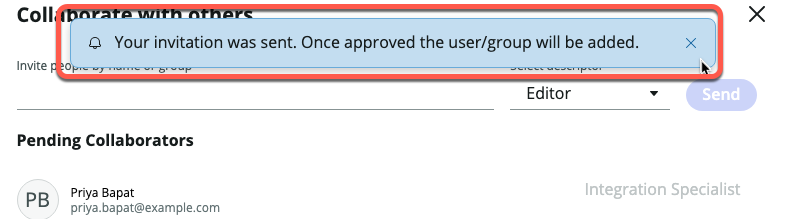
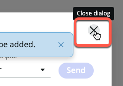

# 10) Request Collaboration on an app

In this exercise, Sydney needs help building an Integration in her app.

She will submit a **[Collaboration Request](https://docs.servicenow.com/csh?topicname=application-collaboration.html&version=latest)** for Priya to assist her. 

{: .highlight}
> Complete the next exercise as Sydney in the **Dev** environment.
>
> If you are following the directions from the last exercise, you should still be impersonating her in **Dev** and still be in **App Engine Studio**.

| 1) Click the **Manage Collaborators** button. 
| 

| 2) Type ```Priya``` into the field **Invite people by name or group**. 
| 3) Click on her name.
| 

| 4) Select **Integration Specialist** in the dropdown and then click **Send**.
| 

| 5) You should see a blue message as below.
| 

| 6) Click the **X** to close the dialog. 
| 


[Next](/lab-aemc-utah/docs/collaboration-approval){: .btn .btn-green .fs-2}