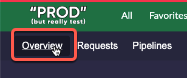
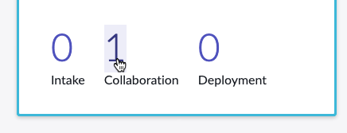
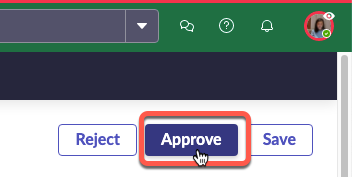

# 11) Approve Collaboration

{: .highlight}
> You should still have a browser tab for **Prod** opened to App Engine Management Center in which you are impersonating Jayne. 
>
> If not, follow these quick instructions to be sure:
>
> 1) Click the avatar in the top-right, then click **Impersonate another user**.
>
> 2) Type **Jayne Nigel** and click **Jayne Nigel**.
>
> 3) Click **Impersonate user**.
>
> 4) Click **All** >> type **app engine management** >> click **App Engine Management Center**.
>
> This will open AEMC in a new browser tab.

| 1) Click **Overview** in App Engine Management Center
|  

| 2) Click the **1** above **Collaboration**
| 

| 3) Click the **DEV** ticket to open Sydney's Collaboration request.
| 

| 4) Click **Approve** in the top-right of the page. 
| 
| 

| 5) Click **Overview** to return to the main AEMC page.
| 

**Great!!** Approving the request triggered AEMC to automatically provision Priya's access to work on the app with Sydney as an Integration Specialist.

{: .important}
> **Integration Specialist** is a custom **[Collaboration Descriptor](https://docs.servicenow.com/csh?topicname=create-collaboration-descriptors.html&version=latest)** created for this lab. 

[Next](/lab-aemc-utah/docs/configure-integration){: .btn .btn-green .fs-2}