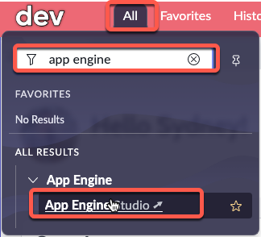

# 12) Configure Integration

In this section, Priya will go to **Dev** and work on Sydney's app.

{: .note-title}
> Priya Bapat
> <table>
> <tbody>
> <tr>
> <td>
> 
> </td>
> <td>
> Priya has many years in IT building integrations on various Platforms.<br/>
> <br/>
> She recently completed some Integration training on ServiceNow and is ready to assist Sydney.<br/>
> </td>
> </tr>
> </tbody>
> </table>

After Jayne approved the Collaboration Request, Priya received an email that she is now a collaborator on the app.

{: .important}
> **SUBJECT:** You are now a collaborator
> <table>
> <tbody>
> <tr>
> <td>
> 
> </td>
> </tr>
> </tbody>
> </table>


{: .note-title}
> Priya Bapat
> <table>
> <tbody>
> <tr>
> <td>
> 
> </td>
> <td>
> She clicks the button in the email to go to App Engine Studio...<br/>
> </td>
> </tr>
> </tbody>
> </table>

{: .warning}
> Complete this section in **DEV**.

| 1) Go to your **Dev** instance.

| 2) In the top right, click the user avatar icon » **Impersonate another user**.
| 

| 3) Type **Priya** and click **Priya Bapat** in the search results.
|

| 4) Click **Impersonate User**. 
| 

| 5) Click **All** » type ```app engine``` » click **App Engine Studio**
| 

{: .highlight}
> This will open AES in a new browser tab.

| 6) Click **My Apps** 
| 

| 7) Click on the **IT Time Off Request** app
| 

| 8) Note some of the differences in Priya's experience versus Sydney's. She does not have access to the **Submit** button to request to deploy the app.  She also can not see or modify any of the **Experiences** in the app. 
| 

| 9) Scroll down and click **+Add** next to **Logic and Automation**.
| 

| 10) Click **Flow**
| 

| 11) Click **Build from scratch**


| 12) Enter ```Send data to Workday``` in the **Name** field and click **Continue**
| 
| 

| 13) Click **Edit this flow**
| 

| 14) Click **Add a trigger**
| 

| 15) Click **Updated**
| 

| 16) In the **Condition** field, type ```time off``` and click the **Time Off Request** table.
| 

| 17) Click **Add filters** next to **Condition**
| 

| 18) Configure a condition of **Active changes to false**
| 

| 19) Click **Done**
| 

| 20) Click **Add an Action, Flow Logic, or Subflow**
| 

| 21) Click **Action** >> type ```log``` >> click **Log**
| 

| 22) Type something in the **Message** field and click **Done**
| 

| 23) Click **Save** in the top-right
| 
| 

| 24) Click **Activate** >> **Activate**
| 
| 

| 25) Click the **App Engine Studio** browser tab and return to the **Dev** platform view.
| 

**Congrats!!** 

Priya has built an integration in the app. It is simplistic for the lab, but in a real world scenario she would build a more complex integration for Sydney. 

She sends a MS Teams message to Sydney letting her know that the integration portion of the app development is completed. 

The app is now ready for Sydney to request it to be deployed. 

[Next](/lab-aemc-utah/docs/deployment-request){: .btn .btn-green .fs-2}