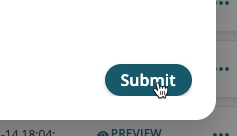
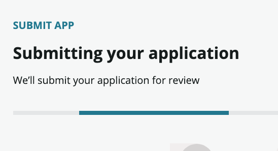
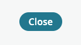
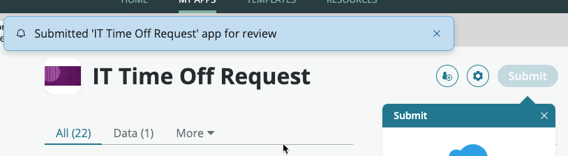

# 13) Request Deployment

{: .warning}
> Complete this section in **DEV**.

| 1) Go to your **Dev** instance.

| 2) In the top right, click the user avatar icon » **Impersonate another user**.
| 

| 3) Type **Sydney Carter** and click **Sydney Carter** in the search results.
| 

| 4) Click **Impersonate User**. 
| 

| 5) Click **All** » type ```app engine``` » click **App Engine Studio**
| 

{: .highlight}
> This will open AES in a new browser tab.

| 6) Click the **IT Time Off Request** tile.
| 

| 7) Click **Submit**.
| 

| 8) Click **Submit** in the pop-up. 
| 

| 9) Scroll down.

| 10) In the **Release notes** field type ```Created from template```.
| 

| 11) Click **Continue**.
| 
| 

| 12) Click **Close** in the bottom-right corner.
| 
| 

{: .note}
> Sydney can continue to edit her app, but she will not be able to Submit another version to deploy until the current deployment request is closed.

Sydney receives an email letting her know that her Deployment Request was submitted. 

{: .important}
> **SUBJECT:** You are now a collaborator
> <table>
> <tbody>
> <tr>
> <td>
> 
> </td>
> </tr>
> </tbody>
> </table>

**Congratulations!** 

Your new developer has built an app and submitted a request to deploy it.


[Next](/lab-aemc-utah/docs/deployment-approval){: .btn .btn-green .fs-2}