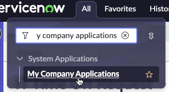

# 14) Approve and Deploy Sydney's App

{: .note-title}
> Jayne Nigel
> <table>
> <tbody>
> <tr>
> <td>
> 
> </td>
> <td>
> Jayne is familiar many different software methodologies such as Agile and SAFe.  
>  
> She is familiar with Update Sets from her ServiceNow training, but she does not regularly work with them. 
>  
> How will she deploy Sydney's app?
> </td>
> </tr>
> </tbody>
> </table>

When Sydney submitted the Deployment Request in App Engine Studio, it triggered an email to Jayne prompting her to take action.

{: .important}
> **SUBJECT:** Developer Collaboration Task DEV0001002 Approval Request
> <table>
> <tbody>
> <tr>
> <td>
> 
> </td>
> </tr>
> </tbody>
> </table>

{: .warning}
>This section is to be completed in your **Production** instance where AEMC is running. That is your controller instance. 

{: .highlight}
> You should still have a browser tab for **Prod** opened to App Engine Management Center in which you are impersonating Jayne. 
>
> If not, follow these quick instructions to be sure:
>
> 1) Click the avatar in the top-right, then click **Impersonate another user**.
>
> 2) Type **Jayne Nigel** and click **Jayne Nigel**.
>
> 3) Click **Impersonate user**.
>
> 4) Click **All** >> type **app engine management** >> click **App Engine Management Center**.
>
> This will open AEMC in a new browser tab.

| 

| 1) In the **Deployment requests** widget, click the new Deployment request number. 
| 

| 9) Review the fields on the form to see the values that Sydney submitted. 

| 10) Click **Approve**.
| 
| 

***Go take a five minute break or stretch.  It can take several minutes or more for the app to deploy to the next environment.***

| 11) To check the status of the Deployment... 

| 12) Click the related list **Deployment Environment R..**
| 

| 13) Click the refresh button to refresh this list. 

| 14) Eventually, you will see a record appear for your deployment. 
| 

| 15) If **Has Error** is **false**, then the app deployed successfully to the next environment. 

| 16) If you have more than two instances in the pipeline, you will need to perform an approval for each environment after Dev. 

***How can you confirm if the app actually deployed?***

| 17) Click **All**.

| 18) Type **My Company Applications**.

| 19) Click **My Company Applications**.
| 

{: .note}
> My Company Applications shows you the applications that have been published to your company's App Repo. 
>
> For more information see **[Product docs: ServiceNow application repository](https://docs.servicenow.com/csh?topicname=app-repo.html&version=latest)**

| 20) You should see the application installed. 
| 

**Congratulations!**  

You have made it!! You deployed an app with the click of a button!

[Next](/lab-aemc-utah/docs/optional-setup-tasks){: .btn .btn-green .fs-2}