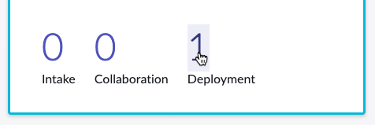
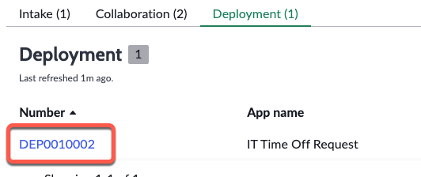
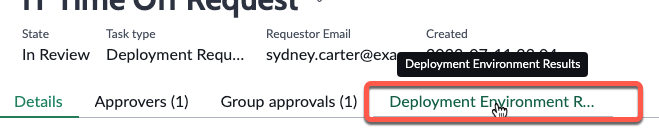
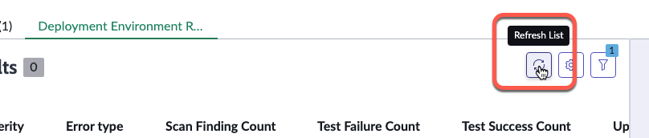
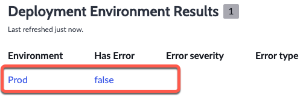
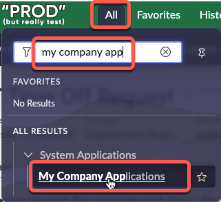
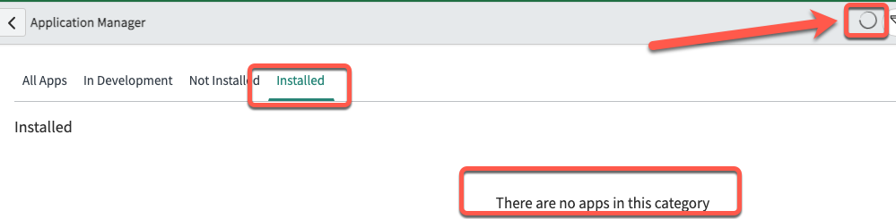
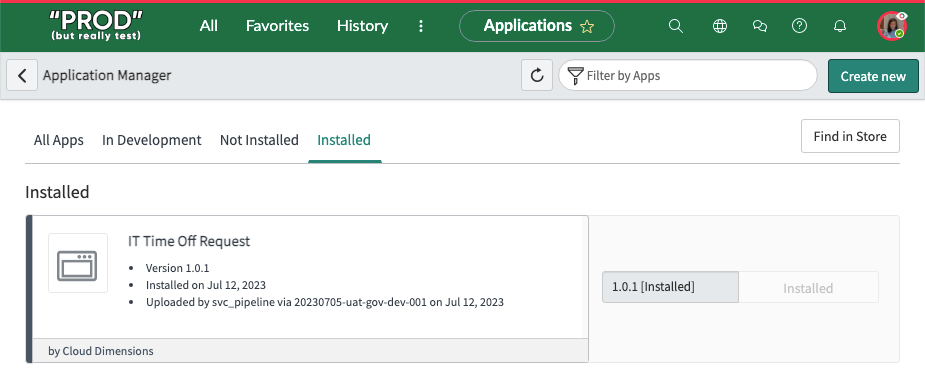

# 14) Approve and Deploy Sydney's App

---

{: .note-title}
> Jayne Nigel
> <table>
> <tbody>
> <tr>
> <td>
> 
> </td>
> <td>
> Jayne is familiar many different software methodologies such as Agile and SAFe.<br/> 
> <br/>
> She is familiar with Update Sets from her ServiceNow training, but she does not regularly work with them.<br/>
> <br/>
> How will she deploy Sydney's app?
> </td>
> </tr>
> </tbody>
> </table>

When Sydney submitted the Deployment Request in App Engine Studio, it triggered an email to Jayne prompting her to take action.

{: .important}
> **SUBJECT:** Developer Collaboration Task DEV0001002 Approval Request
> <table>
> <tbody>
> <tr>
> <td>
> 
> </td>
> </tr>
> </tbody>
> </table>

{: .warning}
>This section is to be completed in your **Production** instance where AEMC is running. That is your controller instance. 

{: .highlight}
> You should still have a browser tab for **Prod** opened to App Engine Management Center in which you are impersonating Jayne. 
>
> If not, follow these quick instructions to be sure:
>
> 1) Click the avatar in the top-right, then click **Impersonate another user**.
>
> 2) Type **Jayne Nigel** and click **Jayne Nigel**.
>
> 3) Click **Impersonate user**.
>
> 4) Click **All** >> type **app engine management** >> click **App Engine Management Center**.
>
> This will open AEMC in a new browser tab.

| 1) Click the **1** above **Deployment**.
| 

| 2) Click the **DEP** ticket to open Sydney's Deployment Request. 
| 

| 3) Click **Approve** in the top-right of the page. 
| 
| 

| 4) To check the status of the Deployment... Click the related list **Deployment Environment R..**
| 

| 5) You click occasionally click the **Refresh** button to check on the progress. Once the app is deployed to the Prod environment a record will appear here. 
| 

{: .highlight}
> This is a good point to go take a five minute break or stretch. It can take several minutes or more for the app to deploy to the next environment.

| 6) Eventually, you will see a record appear for your deployment. 
| 

If **Has Error** is **false**, then the app deployed successfully to the next environment. 

***How can you confirm if the app actually deployed?***

| 17) Click **All** >> type ```My Company Applications``` >> Click **My Company Applications**.
| 

{: .note}
> My Company Applications shows you the applications that have been published to your company's App Repo as well as what is installed on your current instance. 
>
> For more information see **[Product docs: ServiceNow application repository](https://docs.servicenow.com/csh?topicname=app-repo.html&version=latest)**

| 20) Click the **Installed** tab.
| *If the app does not appear in the list, then give it a few minutes to refresh.  There is an icon in the top-right that will stop spinning when the page is done loading.*
| 
| 

**Congratulations!**  

You have made it!! You deployed an app with the click of a button!

That completes the App Engine Governance Lab.

Feel free to explore the Optional Setup Tasks and other References on the side of the page. 
