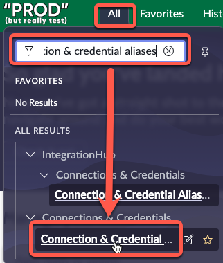
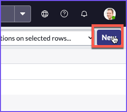
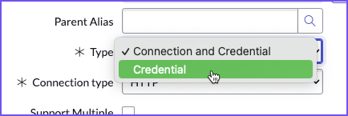
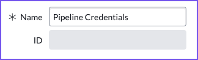
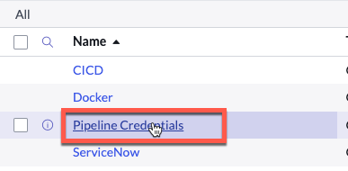
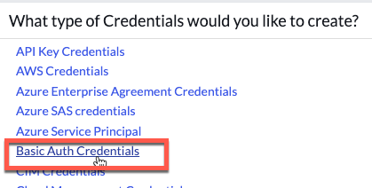
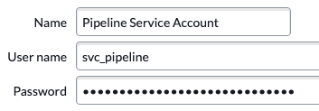

# 2a) Create Credentials in Prod

<button class="btn btn-green fs-3" disabled>Estimated Time to Complete: 10 minutes</button>

## Overview 

In this exercise, you will configure **Service Account Credentials**. These credentials allow App Engine Management Center to communicate with the environments in the pipeline.

{: .highlight}
> For this exercise, the specific Application Scope for the credentials is not critical - Global is acceptable. Always check with your Platform Administrator for any company policies around **<a href="https://docs.servicenow.com/csh?topicname=connection-alias.html&version=latest" target="_blank">Connection and Credential Aliases ↗</a>**.

## Instructions

| 1) Log in to **PROD**.

| 2) Click **All**, then type **Connection & Credential Aliases** in the search box, and click the SECOND **Connection & Credential Aliases** that appears in the drop-down list.
| 

| 3) Click the purple **New** button in the top-right to create a new Credential Alias record. 
| 

| 4) Set the **Type** to **Credential**. 
|  

| 5) Set the **Name** to `Pipeline Credentials` and click **Submit**.
| 
| 

| 6) Click **Pipeline Credentials** to open the record. 
|  

| 7) Navigate to the **Credentials** Related List and click **New** to add a credential. 
| 

| 8) Select **Basic Auth Credentials**.
| 

{: .important}
> You will now input credentials for the App Engine Management Center to use when logging into a remote environment. The password for this remote account is pre-configured. Errors will occur if you do not use the specified password provided below. 

| 9) On the **Basic Auth Credentials** form, fill in the following values and click **Submit**.

**Use the clipboard icon on the right of the gray box below to conveniently copy the values for pasting.**

```markdown
Pipeline Service Account
```
```markdown
svc_pipeline
```
```markdown
ILoveHyperAutomationTimes500!
```

| 

## Lessons Learned

By completing this exercise, you've accomplished the following:
- Created a Service Account Credential in the Prod environment.
- Added a Basic Auth Credential to this account.

[Next](/lab-aemc-utah/docs/credentials-dev){: .btn .btn-green .fs-2}