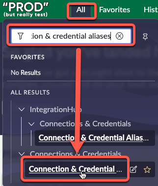
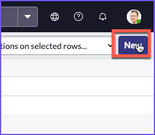
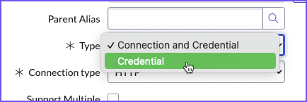
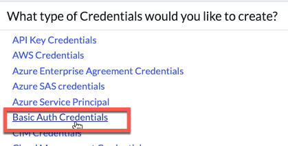
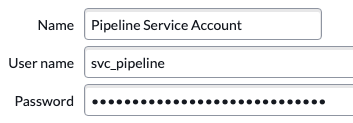

# 2) Credentials

---

In this exercise, we will configure **Service Account Credentials** that allow App Engine Studio and App Engine Management Center to communicate across environments. Check with your company policy on Service Accounts for requirements. 

{: .highlight}
> For the purposes of this exercise, it is not important what Application Scope you create the credentials in. Global is fine.
>
> Check with your Platform Administrator to see if your company has any policies around **[Connection and Credential Aliases](https://docs.servicenow.com/csh?topicname=connection-alias.html&version=latest)**.

{: .warning}
> **Complete the steps below in all of your Lab environments.**
>
> Start with **Prod** then **Test** then **Dev**.
>
> Some Labs may only have a **Prod** and **Dev**.  

| 1) Click **All** » type **Connection & Credential Aliases** » click the SECOND **Connection & Credential Aliases**
| 

| 2) Click the purple **New** button in the top-right to create a new Credential Alias record. 
| 

| 3) Set the **Type** to **Credential**. 
|  

| 4) Set the **Name** to `Pipeline Credentials` and click **Submit**.
| 

| 5) Click **Pipeline Credentials** to open the record. 
| 

| 6) Navigate to the **Credentials** Related List and click **New** to add a credential. 
|

| 7) Select **Basic Auth Credentials**.
|

| 8) On the **Basic Auth Credentials** form, fill in these values and click **Submit**. 
|

**Click the clipboard icon on the right of the gray box below to copy.**

```markdown
Pipeline Service Account
```
```markdown
svc_pipeline
```
```markdown
ILoveHyperAutomationTimes500!
```

{: .warning}
> **STOP!!**
>
> Did you repeat the instructions above for both **Prod** and **Dev**?

[Next](/lab-aemc-utah/docs/configure-prod-environments){: .btn .btn-green .fs-2}