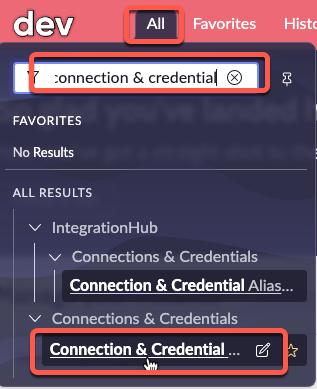

# 2b) Create Credentials in Dev

<button class="btn btn-green fs-3" disabled>Estimated Time to Complete: 10 minutes</button>

## Overview 

In this exercise, the specific Application Scope for the credentials is not essential - Global is acceptable. Be sure to check with your Platform Administrator for any company policies on **[Connection and Credential Aliases](https://docs.servicenow.com/csh?topicname=connection-alias.html&version=latest)**.

{: .highlight}
> For this exercise, the specific Application Scope for the credentials is not critical - Global is acceptable. Always check with your Platform Administrator for any company policies around **<a href="https://docs.servicenow.com/csh?topicname=connection-alias.html&version=latest" target="_blank">Connection and Credential Aliases ↗</a>**.

## Instructions

| 2) Click **All**, then type **Connection & Credential Aliases** in the search box, and click the SECOND **Connection & Credential Aliases** that appears in the dropdown list.
| 

| 3) Click the purple **New** button in the top-right to create a new Credential Alias record. 
| 

| 4) Set the **Type** to **Credential**. 
|  

| 5) Set the **Name** to `Pipeline Credentials` and click **Submit**.
| 
| 

| 6) Click **Pipeline Credentials** to open the record. 
|  

| 7) Navigate to the **Credentials** Related List and click **New** to add a credential. 
| 

| 8) Select **Basic Auth Credentials**.
| 

{: .important}
> You will now input credentials that App Engine Management Center will use to log into a remote environment. The password for this remote account is pre-configured. If you do not use the specified password, you will encounter errors.

| 9) On the **Basic Auth Credentials** form, fill in the following values and click **Submit**.

*Click the clipboard icon on the right of the gray box below to copy.*

```markdown
Pipeline Service Account
```
```markdown
svc_pipeline
```
```markdown
ILoveHyperAutomationTimes500!
```

| 

{: .warning}
> **STOP!!**
>
> Have you executed the above instructions for both **Prod** and **Dev** environments?

## Lessons Learned

In completing this exercise, you have successfully achieved the following milestones:

- Established a thorough understanding of how to set up Service Account Credentials in a development environment.
- Gained experience in creating and managing Connection & Credential Aliases in ServiceNow.
- Familiarized yourself with Basic Authentication Credentials setup.
- Understood the significance of maintaining uniformity in passwords across different environments for seamless connection.

Proceed by clicking 'Next' to begin configuring the Prod environments.

[Next](/lab-aemc-utah/docs/configure-prod-environments){: .btn .btn-green .fs-2}