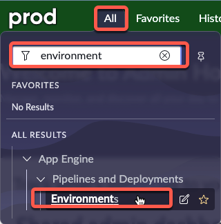
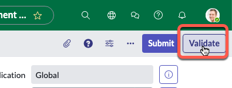
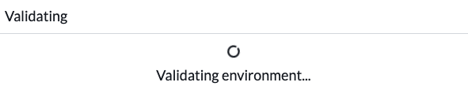
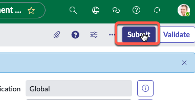
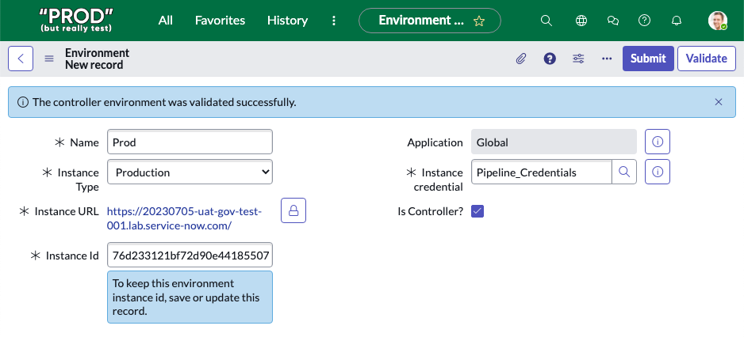

# 3) Configure Environments in Prod Instance

<button class="btn btn-green fs-3" disabled>Estimated Time to Complete: 10 minutes</button>

## Overview 

[Environment records](https://docs.servicenow.com/csh?topicname=config-pipeline-environments.html&version=latest){:target="_blank"} <i class="fas fa-external-link-alt"></i> (`sn_pipeline_environment`) contain information about a ServiceNow instance and how to access it.

Environment records do not sync across instances so creation is required on all instances (production and sub-production).

Environment records are put together in a Pipeline to let App Engine Management Center know what path to promote applications to Production.


{: .highlight}
> For this exercise, the specific Application Scope for the environments is not critical - Global is acceptable. Always check with your Platform Administrator for any company policies around **<a href="https://docs.servicenow.com/csh?topicname=connection-alias.html&version=latest" target="_blank">Connection and Credential Aliases ↗</a>**.
>
> Only users with the **System Administrator** (admin) role can define instance credentials for environments. 
> 
> Users with the **App Engine Administrator** (`sn_app_eng_notify.app_engine_admin`) role can view environment records; however, the Instance credential field is not visible.

## Instructions

{: .warning}
> **Complete this section in PROD.**

| 1) Log in to **Prod**.

| 2) Click **All** >> type **environment** >> click **Environments**
| 

| 3) Click **New** in the top-right.
| 

| 4) Complete the form as below.

| Field | Value 
|:---|:---
| Name | ```Dev``` 
| Instance Type | ```Development``` 
| Instance URL | ```The full URL of your Dev Lab instance (Ex. https://your-lab-123.service-now.com)``` 
| Instance credential | ```Pipeline_Credentials``` 
| Is Controller? | ```Leave unchecked``` 
| Instance Id | ```This will auto populate after clicking Validate.``` 

| 5) Click the "Validate" button. 
| 

| 

| You should see a blue message that says "The environment was validated successfully". 
| 

| 6) Click **Submit** to finish creating the environment record.
| 

**Congratulations!**
You have now created your **Dev Environment** record in your Prod instance.
 
---
Next, we will create the **Prod Environment** record on your Prod instance.  

## Create a Prod Environment Record (*in your Prod instance*)

| 7) Click **New** in the top right.
| 

| 8) Complete the form as below.

| Field | Value 
|:---|:---
| Name | ```Prod``` 
| Instance Type | ```Production``` 
| Instance URL | ```The full URL of your Prod Lab instance (Ex. https://your-lab-123.service-now.com)``` 
| Instance credential | ```Pipeline_Credentials``` 
| Is Controller? | ```Checked``` 
| Instance Id | ```This will auto populate after clicking Validate.``` 

| 9) Click the "Validate" button. 
| 

| You should see a blue or yellow message that says "*The controller environment was validated successfully*". 
| 
| 

| 10) Click **Submit** to finish creating the environment record.
| 

## Lessons Learned

In this exercise, you have:

- Understood the function and importance of Environment records in the ServiceNow platform.
- Successfully configured Environment records for both Development and Production instances in your Prod environment.
- Acquired the knowledge of validating these Environment records.

[Next](/lab-aemc-utah/docs/configure-prod-pipeline){: .btn .btn-green .fs-2}