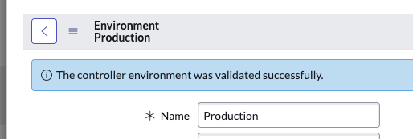
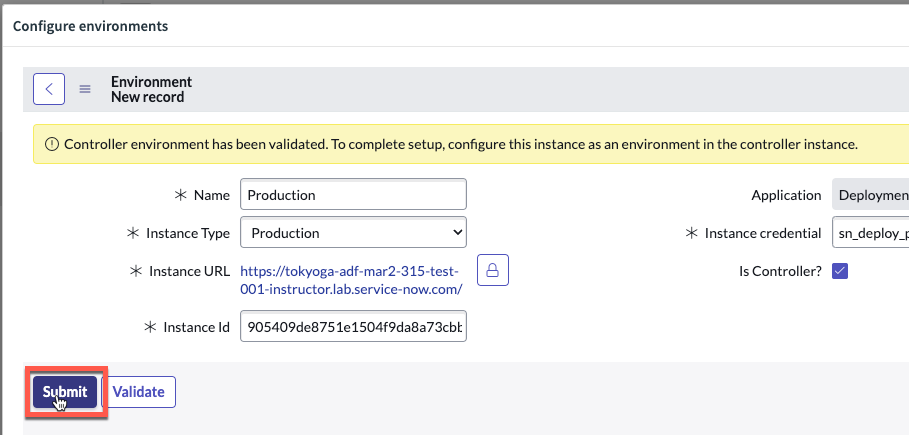

# 3.1.1) Configure Prod Environments 

*Environment ```[sn_pipeline_environment]``` records contain information about a ServiceNow instance and how to access it. Together, they make up a pipeline.*

*You must first configure the environment records before the pipeline can be setup. Environment records do not sync across instances so creation is required on all instances (production and sub-production).*

{: .highlight}
> In this section, you will configure environments for your pipeline on your **Prod** instance.
> 
> *If you only have a **DEV** and **TEST** instance, then treat your **TEST** instance as if it were **PROD**.*

## In your "Prod" instance, configure Dev Environment record ...

{: .warning}
> This section is to be completed in your **production** instance where AEMC will be running.
>
> The Environment records will function fine in any scope, but we recommend changing to the **Deployment Pipeline** scope before continuing. 

| 1) Click **All**. 
| 

| 2) Type **pipelines**.

| 3) Click **Guided Setup** in the Pipelines and Deployments section.

| 4) Click the green **Get Started** button in the top-right. 
| 

| 5) Click **Get Started** in the **Configuring your production instance** section. 
| 

| 6) Click **Configure** in the **Configure Environments** section.  
| 

| 7) Click **New** in the top right. 
| 

| 8) Complete the form as below and click the "Validate" button. 
|  

| Field | Value 
|:---|:---
| Name | ```Dev``` 
| Instance Type | ```Development``` 
| Instance URL | ```The full URL of your Dev Lab instance (Ex. https://your-lab-123.service-now.com)``` 
| Instance credential | ```sn_deploy_pipeline.Pipeline_Credentials``` 
| Is Controller? | ```Leave unchecked``` 
| Instance Id | ```This will auto populate after clicking Validate.``` 

| You should see a blue message that says "The environment was validated successfully". 
|

| 9) Click **Submit** to finish creating the '*Dev*' environment record.

***You have now created your Dev Environment record in your Prod instance.***

## Create the Prod Environment Record

| 15) Click **New** in the top right.
| 

| 16) Complete the form as below and click the 'Validate' button.
|  

| Field | Value 
|:---|:---
| Name | ```Prod``` 
| Instance Type | ```Production``` 
| Instance URL | ```The full URL of your Prod Lab instance (Ex. https://your-lab-123.service-now.com)``` 
| Instance credential | ```sn_deploy_pipeline.Pipeline_Credentials``` 
| Is Controller? | ```Leave unchecked``` 
| Instance Id | ```This will auto populate after clicking Validate.``` 

| You should see a blue message that says "*The controller environment was validated successfully*". 
| 

| 23) Click **Submit** to finish creating the '*Prod*' environment record.
| 

| 24) Click the top-right 'X' to close the modal. 
| 

| 25) In the '*Configure environments*' section', Click '**Mark as Complete**'.
| 

That completes setup of your Environment record in the Prod environment.

Next up, you will configure the Pipeline in the Prod environment.

{: .note}
> For more information see **[Product Documentation: Define environments](https://docs.servicenow.com/csh?topicname=create-environment.html)**

[Next](/lab-aemc-utah/docs/configure-prod-pipeline){: .btn .btn-green .fs-2}