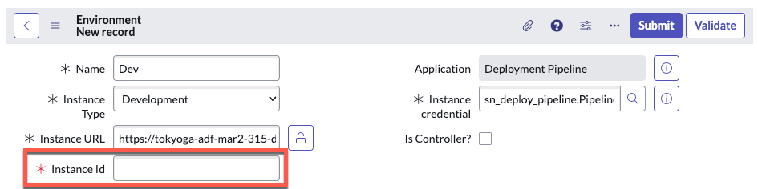

# 3.1.1) Configure Environments in Prod Instance

Environment ```[sn_pipeline_environment]``` records contain information about a ServiceNow instance and how to access it.

You must first configure the environment records before a Pipeline can be setup. Environment records do not sync across instances so creation is required on all instances (production and sub-production).

## Create a Dev Environment Record (in your Prod instance)

{: .warning}
> Complete this section in **PROD**.

{: .highlight}
> For the purposes of this lab, it is not important what Application Scope you create the records in. Global is fine. 
>
> Only users with the **System** **Administrator** (admin) role can define instance credentials for environments. Users with the **App** **Engine** **Administrator** ```[sn_app_eng_notify.app_engine_admin]``` role can view environment records; however, the Instance credential field is not visible.
>
> *If you only have a **DEV** and **TEST** instance, then treat your **TEST** instance as if it were **PROD**.*

| 1) Log in to the **Prod** environment. 

| 2) Click **All** >> type **environment** >> click **Environments** 
| 

| 3) Click **New** in the top-right
| 

| 4) Complete the form as below and click the "Validate" button. 

| Field | Value 
|:---|:---
| Name | ```Dev``` 
| Instance Type | ```Development``` 
| Instance URL | ```The full URL of your Dev Lab instance (Ex. https://your-lab-123.service-now.com)``` 
| Instance credential | ```Pipeline_Credentials``` 
| Is Controller? | ```Leave unchecked``` 
| Instance Id | ```This will auto populate after clicking Validate.``` 

|  

| You should see a blue message that says "The environment was validated successfully". 
|

| 5) Click **Submit** to finish creating the environment record.

You have now created your Dev Environment record in your Prod instance.
 
Next, we will create the Prod environment record on the Prod instance.  

## Create a Prod Environment Record (in your Prod instance)

| 6) Click **New** in the top right.
| 

| 7) Complete the form as below and click the 'Validate' button.

| Field | Value 
|:---|:---
| Name | ```Prod``` 
| Instance Type | ```Production``` 
| Instance URL | ```The full URL of your Prod Lab instance (Ex. https://your-lab-123.service-now.com)``` 
| Instance credential | ```Pipeline_Credentials``` 
| Is Controller? | ```Checked``` 
| Instance Id | ```This will auto populate after clicking Validate.``` 

| 

| You should see a blue message that says "*The controller environment was validated successfully*". 
| 

| 8) Click **Submit** to finish creating the '*Prod*' environment record.
| 

That completes setup of your Environment records in the Prod environment.

Next up, you will configure the Pipeline in the Prod environment.

{: .note}
> For more information see **[Product Documentation: Define environments](https://docs.servicenow.com/csh?topicname=config-pipeline-environments.html&version=latest)**

[Next](/lab-aemc-utah/docs/configure-prod-pipeline){: .btn .btn-green .fs-2}