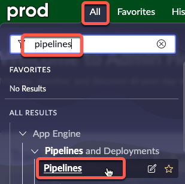

# 3.1.2) Configure Pipeline in Prod only

A pipeline defines the path an application takes from the development to production environments and allows administrators to quickly move applications across instances.

Set up and configure your pipeline by specifying the environments to include along with their position in the pipeline.

The Pipeline is only configured on the Controller Environment, which is the Production instance. 

{: .warning}
> Complete this section in **PROD**.

{: .highlight}
> *If you only have a **DEV** and **TEST** instance, then treat your **TEST** instance as if it were **PROD**.*

| 1) Click **All** >> type **pipelines** >> click **Pipelines** 
| 

| 2) Click **New** in the top-right
| 

| 3) Complete the form as below. Click Submit when complete.

| Field | Value 
|:---|:---
| Name | ```Main Pipeline``` 
| Pipeline Type | ```Application Deployment```
| Source Environment | ```Dev```
| Active | Checked

| 

| 4) Click **Main Pipeline** to open the record.
| 

| 5) In the **Pipeline Environments Order** related list, click **New**.
| 

| 6) Complete the form as below. Click **Submit** when complete.

| Field | Value 
|:---|:---
| Pipeline | ```Main Pipeline``` 
| Environment | ```Prod```
| Order | ```100```

| 

**Congratulations!** You have created a **Pipeline** in your Prod environment to deploy applications with!

{: .note}
> For more information see **[Product Documentation: Create a pipeline](https://docs.servicenow.com/csh?topicname=config-p-and-d.html&version=latest)**

[Next](/lab-aemc-utah/docs/configure-non-prod){: .btn .btn-green .fs-2}