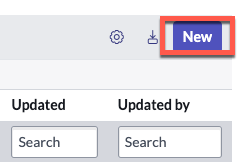
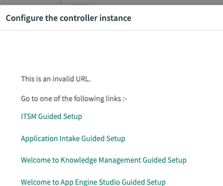
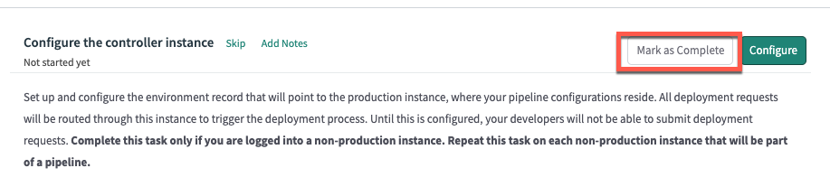

# 3.2) Configure non-Prod Controller

*In each sub-production instance, set up and configure the Environment record which will point to the controller instance (production), where the deployment pipeline configurations reside.*

*All deployment requests are routed through the controller instance. Until this is configured, your developers will not be able to submit deployment requests.*

{: .highlight}
> In this section, you will be working in your **DEV** instance.

{: .warning}
> Environment records will function fine in any scope, but we recommend changing to the **Deployment Pipeline** scope before continuing.

## Environment setup

| 1) Log in to the **DEV** environment. 

| 2) Click **All**, Type ```pipeline```. 
| 

| 3) Click **Guided Setup**. 
| 

| 4) In the section '*Configuring your non-production instances*', click **Get Started**. 
| 

| 5) In the section '*Configure the controller instance*', click **Configure**. 
| 

| 6) Click **New**. 
| 

| 7) Complete the form using the information below. 
| 

| Field | Value 
|:---|:---
| Name | ```Prod``` 
| Instance Type| ```Production``` 
| Instance URL | ```The full URL of your Prod Lab instance (Ex. https://your-lab-123.service-now.com)``` 
| Instance credential | ```sn_deploy_pipeline.Pipeline_Credentials``` 
| Is Controller? | ```Leave unchecked``` 
| Instance Id | ```This will auto populate after clicking Validate```

| You should see a blue message that says "The controller environment was validated successfully". 
| 

| 14) Click **Submit** to finish creating the **Prod** environment record.
| 

{: .highlight}
> If you get a message like below that says '*This is an invalid URL.*', click **X** in the top right and close the modal. 
>
> 
>
> This error can be safely ignored

| 14.1) Click **Mark as Complete**
| 

**Congratulations!**

You're one step closer to deploying apps with App Engine Management Center. 

[Next](/lab-aemc/docs/app-intake){: .btn .btn-green .fs-2}