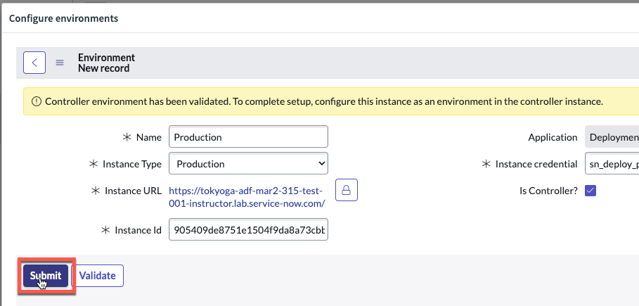

# 3.2) Configure Controller Environment in Dev Instance

We will make sure the Dev environment knows where to send Deployment Requests. 

They will get sent to App Engine Management Center in Production for review by the App Engine Admin Group.

{: .warning}
> Complete this section in **DEV**.

{: .highlight}
> Environment records will function fine in any scope, but the **Deployment Pipeline** scope is a good one to use if not sure.

## Environment setup

| 1) Log in to the **DEV** environment. 

| 2) Click **All** >> type **environment** >> click **Environments** 
| 

| 3) Click **New** in the top-right
| 

| 4) Complete the form using the information below. 

| Field | Value 
|:---|:---
| Name | ```Prod``` 
| Instance Type| ```Production``` 
| Instance URL | ```The full URL of your Prod Lab instance (Ex. https://your-lab-123.service-now.com)``` 
| Instance credential | ```sn_deploy_pipeline.Pipeline_Credentials``` 
| Is Controller? | ```Checked``` 
| Instance Id | ```This will auto populate after clicking Validate```

| 

| You should see a blue message that says "The controller environment was validated successfully". 
| 

| 14) Click **Submit** to finish creating the **Prod** environment record.
| 

{: .highlight}
> If you get a message like below that says '*This is an invalid URL.*', click **X** in the top right and close the modal. 
>
> 
>
> This error can be safely ignored

**Congratulations!**

You're one step closer to deploying apps with App Engine Management Center. 

{: .note}
> For more information see **[Product Documentation: Define environments](https://docs.servicenow.com/csh?topicname=config-pipeline-environments.html&version=latest)**

[Next](/lab-aemc-utah/docs/app-intake){: .btn .btn-green .fs-2}