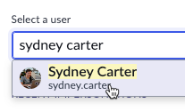

# 4.1) Request to be a developer

{: .note-title}
> Sydney Carter
> <table>
> <tbody>
> <tr>
> <td>
> 
> </td>
> <td>
> Sydney Carter has been in IT for years in various roles.<br/>
> <br/>
> She wants to join her company's Citizen Developer Program.<br/>
> <br/>
> This section will show what that experience is like.
> </td>
> </tr>
> </tbody>
> </table>

| 1) In the top right, click the **System Administrator** avatar >> **Impersonate user**.
| 

| 2) Type **Sydney Carter** and click **Sydney Carter** in the search results.
| 

| 3) Click **Impersonate User**. 
| 

| 4) Click **All** >> type **service portal** >> click **Employee Center** 
| 

| 5) Click **IT for IT** 
| 

| 6) Click **Apply for Citizen Development - V2**
| 

| 7) Fill out the form with the values below. 

| Field | Value 
|:---|:---
| Application Name | ```Request Time Off``` 
| Describe your idea in a few sentences | ```Allow IT users to request time off with approvals.```
| Is your process repeatable? | ```Yes```
| Do you have an email or excel-based process? | ```Yes```
| How many users are involved in this? | ```>20```
| Does this involve any sensitive/PII data? | ```No```
| Do you need data from other departments? | ```No```
| Who are the users that will have access to the data in this application? | ```Anyone in the IT Department```

| 8) Click **Submit**.

| 9) After the request is submitted, close the browser tab and return to the original browser tab for "Prod". 

At this point, Sydney will receive an email letting her know the status of her request. 

| 

[Next](/lab-aemc-utah/docs/approval){: .btn .btn-green .fs-2}