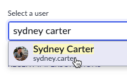
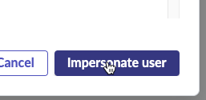
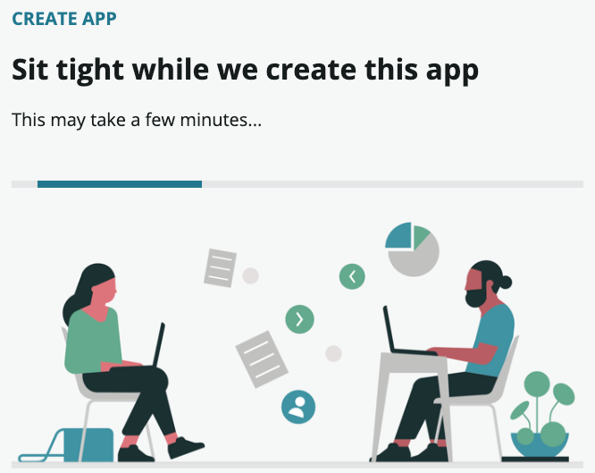
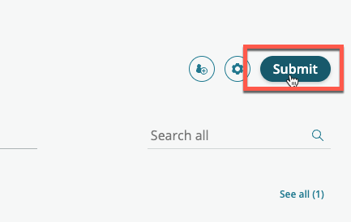
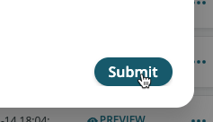
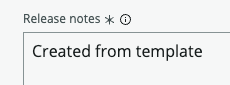
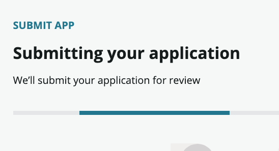
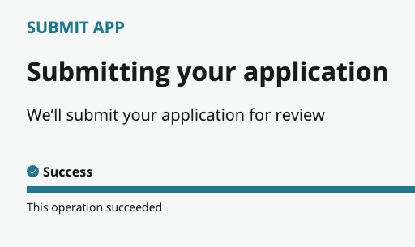
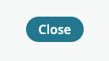
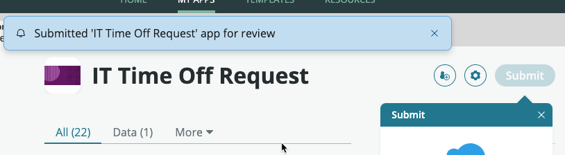

# 4.3) Build the app

In this section, Sydney will build her app. 

After Jayne approved her request, she received an email that her app has been approved. 

{: .important}
> **SUBJECT:** Your app has been approved
> <table>
> <tbody>
> <tr>
> <td>
> 
> </td>
> </tr>
> </tbody>
> </table>


{: .note-title}
> Sydney Carter
> <table>
> <tbody>
> <tr>
> <td>
> 
> </td>
> <td>
> She clicks the button in the email to go to App Engine Studio...<br/>
> </td>
> </tr>
> </tbody>
> </table>

{: .warning}
>This section is to be completed in your **development** instance where development takes place.

| 1) Go to your **Dev** instance.

| 2) Click the avatar in the top-right, then click **Impersonate User**.
| 

| 3) Type ```Sydney Carter``` and click **Sydney Carter** in the search results.
| 

| 4) Click **Impersonate User**. 
| 

| 5) Click **All**.
| 

| 6) Type ```app engine```.

| 7) Click on **App Engine Studio**.
| 

{: .highlight}
> This will open AES in a new browser tab.

| 8) Close the **Get Started** dialog. 
| 

| 9) At top of page, click **TEMPLATES**.
| 

| 10) Move your mouse over **Time Off Template**.
| 

| 11) Click **Use template**.
| 

| 12) Enter the name ```IT Time Off Request```.

| 13) Click **Continue**.

| 14) Go take a five minute break while the app builds from the template.  
| 

| 15) Click **Go to app home**.
| 

| 16) Click **Submit**.
| 

{: .note}
> Feel free to look around App Engine Studio, but the main focus of this lab is deploying the app. 

| 17) Click **Submit** in the pop-up. 
| 

| 18) Scroll down.

| 19) In the **Release notes** field type ```Created from template```.
| 

| 20) Click **Continue**.
| 
| 

| 21) Click **Close**. 
| 
| 

{: .note}
> Sydney can continue to edit her app, but she will not be able to Submit another version to deploy until the current deployment request is closed.

**Congratulations!** 

Your new developer has built and app and submitted a request to deploy it.

[Next](/lab-aemc-utah/docs/collaboration){: .btn .btn-green .fs-2}