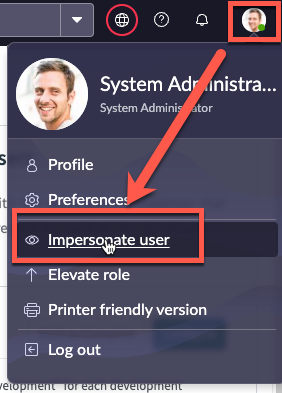
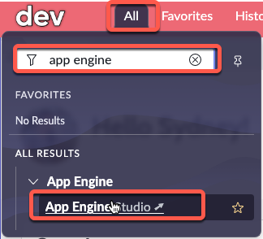
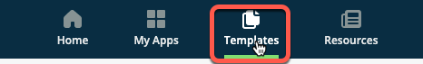
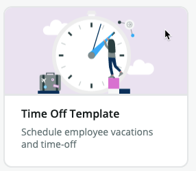
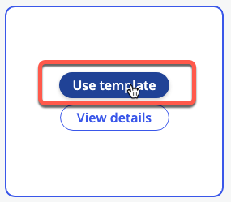
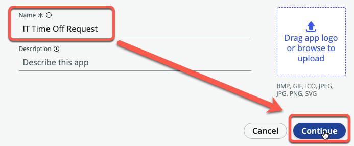
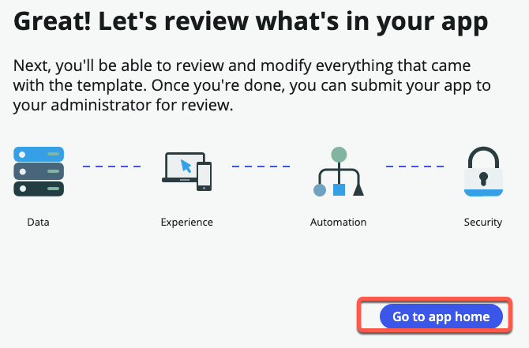

# 4.3) Build the app

In this section, Sydney will build her app. 

After Jayne approved her request, she received an email that her app has been approved. 

{: .important}
> **SUBJECT:** Your app has been approved
> <table>
> <tbody>
> <tr>
> <td>
> 
> </td>
> </tr>
> </tbody>
> </table>


{: .note-title}
> Sydney Carter
> <table>
> <tbody>
> <tr>
> <td>
> 
> </td>
> <td>
> She clicks the button in the email to go to App Engine Studio...<br/>
> </td>
> </tr>
> </tbody>
> </table>

{: .warning}
> Complete this section in **DEV**.

| 1) Go to your **Dev** instance.

| 2) In the top right, click the **System Administrator** avatar >> **Impersonate user**.
| 

| 3) Type ```Sydney Carter``` and click **Sydney Carter** in the search results.
| 

| 4) Click **Impersonate User**. 
| 


| 5) Click **All** » type ```app engine``` » click **App Engine Studio**
| 

{: .highlight}
> This will open AES in a new browser tab.

| 6) At top of page, click **Templates**.
| 

| 7) Move your mouse over **Time Off Template**.
| 

| 8) Click **Use template**.
| 

| 9) Enter the name ```IT Time Off Request``` and click **Continue**
| 

| 10) Go take a five minute break while the app builds from the template. This is a good time to stretch your legs, check your email, etc. 
| 
| 

| 11) Click **Go to app home**.
| 

{: .highlight}
> In this lab, we are not exploring App Engine Studio; however, feel free to take a moment and explore the application that was built if you have time. 

**Congratulations!**

The template allowed Sydney to quickly deploy an app.  She can now customize it for her needs before requesting to have it deployed to Production. 

[Next](/lab-aemc-utah/docs/collaboration){: .btn .btn-green .fs-2}