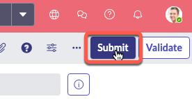

# 5) Configure Controller Environment in Dev Instance

---

Production is considered the "Controller" Environment as that is where App Engine Management Center is installed and orchestrates activities from. 

Next up, you add an Environment record to your Dev instance containing the details for your Prod instance. 

{: .warning}
> Complete this section in **DEV**.

{: .highlight}
> For the purposes of this exercise, it is not important what Application Scope you create the environment records in. Global is fine. 

## Environment setup

| 1) Log in to the **DEV** environment. 

| 2) Click **All** >> type **environment** >> click **Environments** 
| 

| 3) Click **New** in the top-right
| 

| 4) Complete the form using the information below. 

| Field | Value 
|:---|:---
| Name | ```Prod``` 
| Instance Type| ```Production``` 
| Instance URL | ```The full URL of your Prod Lab instance (Ex. https://your-lab-123.service-now.com)``` 
| Instance credential | ```Pipeline_Credentials``` 
| Is Controller? | ```Checked``` 
| Instance Id | ```This will auto populate after clicking Validate```

| 5) Click the "Validate" button.
| 

| 

| You should see a blue message that says "The controller environment was validated successfully". 
| 

| 6) Click **Submit** to finish creating the **Prod** environment record.
| 

**Congratulations!**

You're one step closer to deploying apps with App Engine Management Center. 

[Next](/lab-aemc-utah/docs/configure-app-intake){: .btn .btn-green .fs-2}