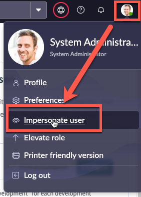

# 5.1) Onboard a developer

{: .note-title}
> Sydney Carter
> <table>
> <tbody>
> <tr>
> <td>
> 
> </td>
> <td>
> Sydney Carter has been in IT for years in various roles.<br/>
> <br/>
> She wants to join her company's Citizen Developer Program.<br/>
> <br/>
> This section will show what that experience is like.
> </td>
> </tr>
> </tbody>
> </table>

| 1) In the top right, click the **System Administrator** avatar >> **Impersonate user**.
| 

| 2) Type **Sydney Carter** and click **Sydney Carter** in the search results.
| 

| 3) Click **Impersonate User**. 
| 

| 4) Click **All** >> type **employee center** >> click **Employee Center** 
| 

| 5) Click **IT for IT** 
| 

| 6) Click **Apply for Citizen Development**
| 

{: .highlight}
> This error message only appears for users logged in with the admin role even if impersonating.
>
> 
>
> In the real world, users with the **admin** role would **not be** applying for citizen development. 

| 11) Fill out the form with the values below. 

| Field | Value 
|:---|:---
| Application Name | ```Request Time Off``` 
| Describe your idea | ```Allow users to request time off with approvals.```
| Is your process repeatable? | ```Yes```
| Do you have an email... ? | ```No```
| How many users... ? | ```>20```
| Does this involve... ? | ```No```
| Do you need data... ? | ```No```
| Who are the users... ? | ```Anyone in the IT Department```

| 12) Click **Submit**.

| 13) After the request is submitted, close the browser tab and return to the original browser tab. 

| 14) Click the avatar in the top-right, then click **Impersonate another user**.
| 

| 15) Type **Jayne Nigel** and click **Jayne Nigel**.
| 

| 16) Click **Impersonate user**.

{: .note-title}
> Jayne Nigel
> <table>
> <tbody>
> <tr>
> <td>
> 
> </td>
> <td>
> Jayne is our App Engine Admin that we configured earlier in Lab 1, Step 22.<br/>
> <br/>
> She is not a Platform Administrator.<br/>
> <br/>
> She is responsible for managing requests from App Engine Users.
> </td>
> </tr>
> </tbody>
> </table>

| 17) Click **All**.

| 18) Type **app engine management**.

| 19) Click **App Engine Management Center**.
| 

{: .highlight}
> This will open AEMC in a new browser tab.

| 20) In the **Intake application requests** widget, click Sydney's request to open it. 
| 

| 21) In the top right, click **Approve**.
| 

{: .note}
> The Prod instance will attempt to configure Sydney's App Engine User access on the Dev environment.
>
> In the real world, there might be more than one person to do the approval and more time may be taken to review the answers.

| 22) Click **X** to close the RITM tab in AEMC.
| 

**Congratulations!** 

Sydney is ready begin building her first app.

Jayne was able to configure Sydney's access **without** the admin role by clicking Approve on the request.

[Next](/lab-aemc-utah/docs/build-app){: .btn .btn-green .fs-2}