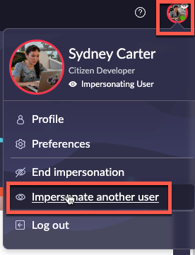
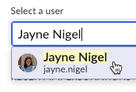
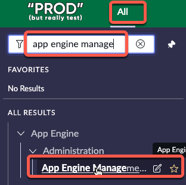
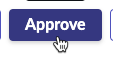

# 5.2) Approval

| 1) Click the avatar in the top-right, then click **Impersonate another user**.
| 

| 2) Type **Jayne Nigel** and click **Jayne Nigel**.
| 

| 3) Click **Impersonate user**.

{: .note-title}
> Jayne Nigel
> <table>
> <tbody>
> <tr>
> <td>
> 
> </td>
> <td>
> Jayne is the App Engine Admin. 
>  
> She is not a Platform Administrator and does not have the 'admin' role in any environment. 
>  
> She is responsible for managing requests from App Engine Users, which will trigger automated testing and deployments. 
> </td>
> </tr>
> </tbody>
> </table>

| 4) Click **All** >> type **app engine management** >> click **App Engine Management Center**.
| 
| 
| 

{: .highlight}
> This will open AEMC in a new browser tab.

| 7) In the **Intake application requests** widget, click Sydney's request to open it. 
| 

| 8) In the top right, click **Approve**.
| 

{: .note}
> The Prod instance will attempt to configure Sydney's App Engine User access on the Dev environment.
>
> In the real world, there might be more than one person to do the approval and more time may be taken to review the answers.

| 9) Click **X** to close the RITM tab in AEMC.
| 

**Congratulations!** 

Sydney is ready begin building her first app.

Jayne was able to configure Sydney's access **without** the admin role by clicking Approve on the request.

[Next](/lab-aemc-utah/docs/build-app){: .btn .btn-green .fs-2}