# 8) Approve Developer Intake Requests

---

In this section, our **App Engine Admin** Jayne will review and approve Sydney's App Intake request. 

{: .note-title}
> Jayne Nigel
> <table>
> <tbody>
> <tr>
> <td>
> 
> </td>
> <td>
> Jayne is the App Engine Admin. 
>  
> She is not a Platform Administrator and does not have the 'admin' role in any environment. 
>  
> She is responsible for managing requests from App Engine Users. Her approvals will trigger automation to provision user access, deploy apps to environments, and other activities. 
> </td>
> </tr>
> </tbody>
> </table>

When Sydney submitted her Intake Request it triggered an email to Jayne to let her know to take action. 

{: .important}
> **SUBJECT:** Please select user permission type for a new app request
> <table>
> <tbody>
> <tr>
> <td>
> 
> </td>
> </tr>
> </tbody>
> </table>

| 1) Click the avatar in the top-right, then click **Impersonate another user**.
| 

| 2) Type **Jayne Nigel** and click **Jayne Nigel**.
| 

| 3) Click **Impersonate user**.
| 4) Click **All** >> type **app engine management** >> click **App Engine Management Center**.
| 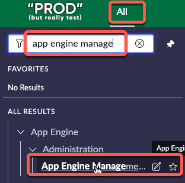

{: .highlight}
> This will open AEMC in a new browser tab.

| 5) In the **Pending requests to complete** widget, click the number **1** above **Intake** to open Sydney's request. 
| 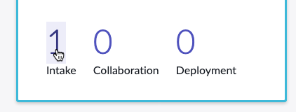

| 6) Click the **RITM** number to open Sydney's request.
| 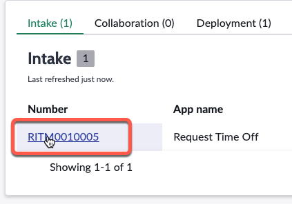

| 7) Scroll down the left-hand side of the page in the **Details** section.
|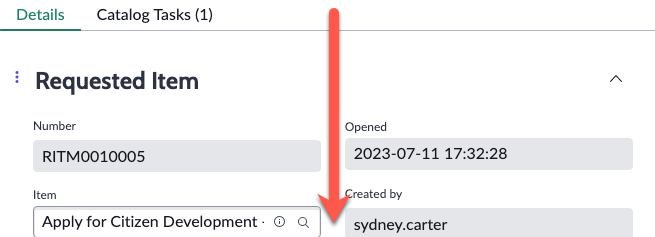

| 8) In the **Administration** section of the form, click on the **Permission type** drop-down field.
| 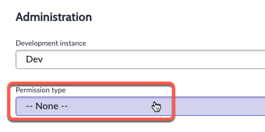

| 9) Click on **Create/edit applications (AES User Group)**
| 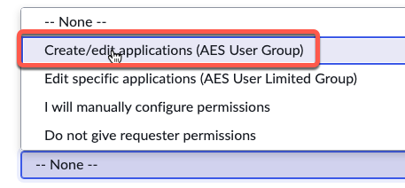

| 10) Scroll to the top of the page and click **Save** in the top right. 
| 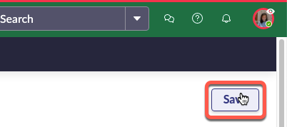

| 11) Click on the **Catalog Tasks (1)** related list. 
| 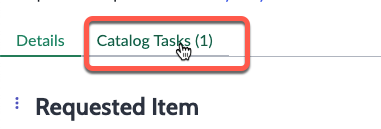

| 12) Click the **SCTASK** number to open the Catalog Task.
| 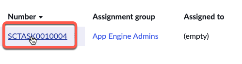

| 13) Click **Close Task** in the top-right.
| 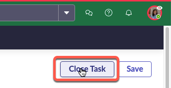

| 14) Click the i circle next to the **RITM** number to go back to the **RITM** record. 
| 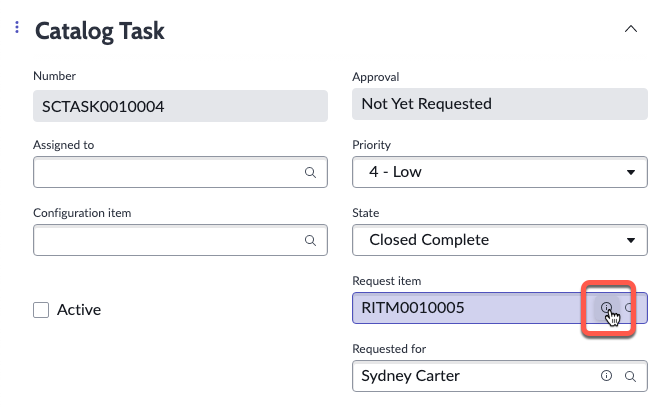

| 15) Click **Approve** in the top-right of the page. 
| 
| 

{: .note}
> The Prod instance will attempt to configure Sydney's App Engine User access on the Dev environment.
>
> In the real world, there might be more than one person to do the approval and more time may be taken to review the answers.
>
> You may also want to require the person to undergo additional training before approving their access to build applications. 

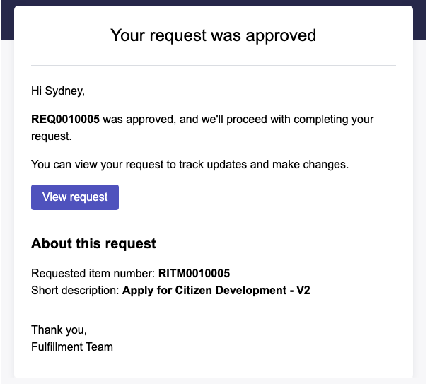

{: .important}
> **SUBJECT:** Request REQ0010005 was approved
> <table>
> <tbody>
> <tr>
> <td>
> 
> </td>
> </tr>
> </tbody>
> </table>

**Congratulations!** 

Sydney is ready begin building her first app.

Jayne was able to configure Sydney's access **without** the need for the admin role.

[Next](/lab-aemc-utah/docs/build-app){: .btn .btn-green .fs-2}