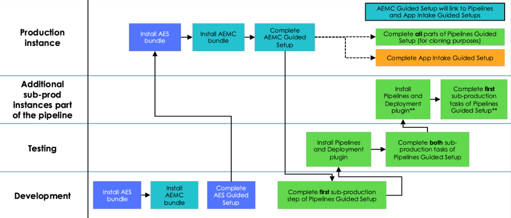

# How do I configure App Engine Studio?
{: .no_toc }

{: .highlight}
> This part of the lab is for information purposes only. No activity required.
>
> Later exercises in the Lab will guide you through the needed configuration steps. 

*Repeat steps across all sub-production instances, as necessary*

{: .note }
> If you plan on cloning your production instance to one or more non-production instances, you should also install the AES product on your production instance prior to cloning.
>
> Additionally, the AEMC plugin must be installed on all instances to appropriately collect application and developer data on development. 
> 
> For more information, see **[Product Documentation: System clone](https://docs.servicenow.com/csh?topicname=c_SystemClone.html&version=latest)**

The App Engine Studio bundle has three Guided Setup modules to assist in configuration:
- **[App Engine Studio – Configuration Guided Setup](https://docs.servicenow.com/csh?topicname=configure-aes.html&version=latest)**
  - Configure foundational application components and provision initial user access
- **[Pipeline and Deployment Guided Setup](https://docs.servicenow.com/csh?topicname=config-p-and-d.html&version=latest)**
  - Configure pipelines to deploy applications across instances with confidence
- **[Application Intake Guided Setup](https://docs.servicenow.com/csh?topicname=config-app-intake.html&version=latest)**
  - Configure application intake catalog item and process to enable business users to submit application requests from an existing service portal.

{: .note}
> **App Engine Management Center** is dependent on the configuration of **Pipelines and Deployment**, and optionally **Application Intake**
> 
> For more information, see **[Product Documentation: Using Guided Setup](https://docs.servicenow.com/csh?topicname=guided-setup.html&version=latest)**

In this lab, we will be going through the same steps covered in the Guided Setup, but we will not be utilizing Guided Setup. 

{: .note}
> For more information see: 
> - **[ServiceNow Store: Install a ServiceNow Product](https://store.servicenow.com/%24appstore.do%23!/store/help?article=KB0030186)**
> - **[Product Documentation: Install App Engine Studio](https://docs.servicenow.com/csh?topicname=install-aes.html&version=latest)**

## Service Accounts

At a point in the setup of the Pipeline, you will need to provide a Service Account that can be used by the instances to communicate with each other.  Check with your company policy on Service Accounts for requirements. 

{: .highlight}
> Your Lab instance has a Service Account already pre-configured to use in the lab. 

[Next](/lab-aemc-utah/docs/configure-aes){: .btn .btn-green .fs-2}
