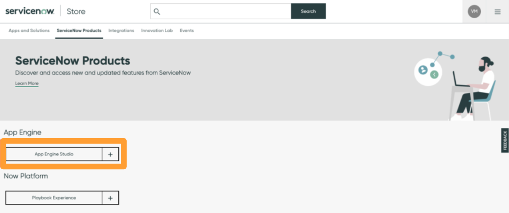
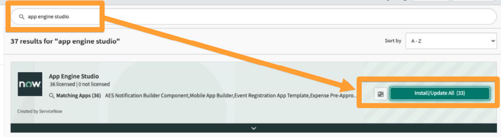

# How do I install App Engine Studio?
{: .no_toc }

{: .highlight}
> This part of the lab is for information purposes only. No activity required.
>
> **App Engine Studio** and **App Engine Management Center** have already been installed onto your Lab instances. 

## Opt-in and manage entitlements

Before installing the application from the ServiceNow Store, verify the instance has valid ServiceNow entitlements.

In the ServiceNow Store, use the search criteria to find App Engine Studio.

Click **Opt-in** and agree to the ServiceNow terms and conditions to verify entitlements.

Click **Manage Entitlements** and set the ‘Entitlement Type’ value to **Entitle all Instances** (if you prefer to manually select which instances which will be affected, select Entitle Selected Instances).

## Install the App Engine Studio application

To install the App Engine Studio application (***com.snc.app-engine-studio***), login to your **development** instance and navigate to **System Applications** >> **All Available Applications** >> **All**.

Use the search criteria to find the App Engine Studio application. Click **Install / Update All**.

The App Engine Studio bundle will be installed in the development instance – including the App Engine Studio application and all dependent applications.

Repeat this process on all instances for cloning purposes.

{: .note}
> For more information see 
> - **[Product Documentation: Install App Engine Studio](https://docs.servicenow.com/csh?topicname=install-aes.html)** 
> - **[ServiceNow Store: Install a ServiceNow Product](https://store.servicenow.com/%24appstore.do%23!/store/help?article=KB0030186)**

[Next](/lab-aemc-utah/docs/how-to-configure){: .btn .btn-green .fs-2}